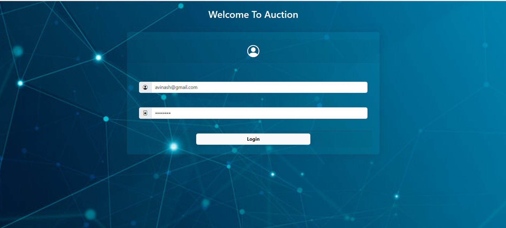
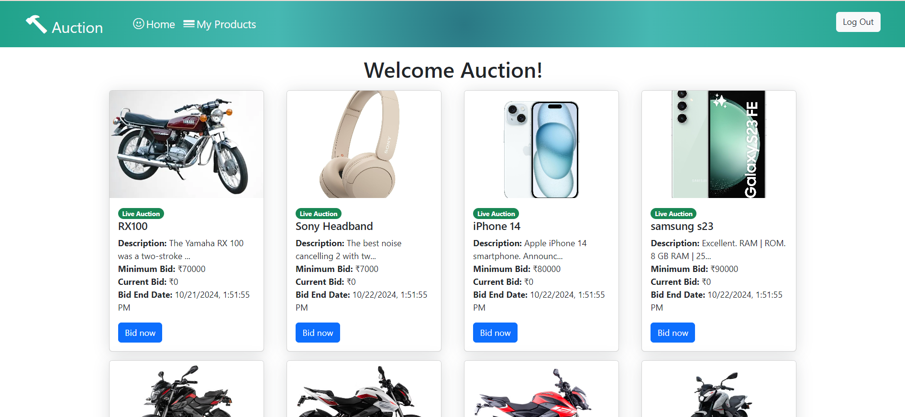
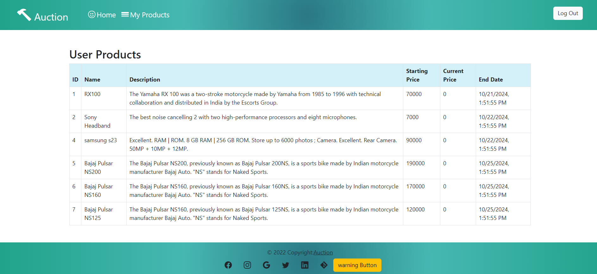

# Auction Web Application

## Overview

This full-stack web application allows users to participate in an online bidding system. With features like user authentication, auction item management, and bidding functionality, users can easily create, view, and manage their auction activities.

## Goals

### User Goals
- Users can easily sign up, log in, and manage their auction activities.
- Users can create, view, update, and delete auction items.
- Users can participate in auctions by placing and tracking bids.

### Non-Goals
- Does not include advanced auction features like auto-bidding.
- Does not require a complex recommendation system for auction items.

## User Stories

1. **User login and Authentication**
   - As a user, I want to register with my username, email, and password so that I can create an account.
   - As a user, I want to log in with my email and password so that I can access my account.

2. **Auction Management**
   - As a user, I want to create auction items with a title, description, starting bid, and end date so that I can sell items.
   - As a user, I want to view all available auction items so that I can find items to bid on.
   - As a user, I want to update my auction items so that I can correct any mistakes or add new information.
   - As a user, I want to delete my auction items so that I can remove items I no longer wish to sell.

3. **Bidding Functionality**
   - As a user, I want to place bids on auction items so that I can participate in auctions.
   - As a user, I want to view the current highest bid and bid history for an auction item so that I can make informed bidding decisions.
   - As a user, I want to receive notifications when I am outbid so that I can decide if I want to place a higher bid.

4. **User Interface**
   - As a user, I want a home page that displays a list of auction items with their current highest bids.
   - As a user, I want an auction item page that shows detailed information and bid history.
   - As a user, I want a profile page where I can manage my information and view my auction activities.





## Overview

This full-stack web application allows users to participate in an online bidding system...


## User Experience

### Home Page
- Display a list of auction items with their current highest bids.
- Include search and filtering options for auction items (optional).
- Implement pagination for a better user experience (optional).

### Auction Item Page
- Show detailed information about the auction item.
- Display bid history.
- Provide a form for placing bids.

### User Profile Page
- Allow users to manage their information.
- Display user's auction items and bids.

## Narrative

Imagine logging into a seamless and intuitive web application where you can easily participate in online auctions. You start by creating an account, and within minutes, you're browsing a variety of auction items. You find something you like, place a bid, and get notified immediately when someone outbids you. Managing your auction items is just as simple – you can create, update, or delete listings with a few clicks. This application ensures a smooth, engaging, and secure auction experience, making online bidding both fun and hassle-free.

## Success Metrics
- **User Engagement:** Number of active users, number of auctions created, and bids placed.
- **Functionality:** All specified features work correctly without errors.
- **User Experience:** User satisfaction ratings, low bounce rate on key pages.
- **Code Quality:** Clean, well-organized code with meaningful commit messages.
- **Documentation:** Comprehensive and easy-to-follow setup instructions.

## Technical Considerations

### Front-End
- Use a modern front-end framework (React).
- Ensure the UI is responsive and user-friendly.
- Implement form validation for user inputs.

### Back-End
- Use bcrypt for password hashing.
- Use ASP.NET CORE Web API with Express to build the RESTful API.
- Implement API endpoints for user registration, login, auction item management, and bidding functionality.
- Ensure secure handling of user authentication with JWT.

### Database
- Use a relational database (MySQL).
- Design appropriate schemas/models for users, auction items, and bids.
- Aution database contains users, products, userproduct tables.

### Security
- Use bcrypt for password hashing.
- Ensure secure handling of user authentication with JWT.

## Getting Started

1. **Clone the repository:**
   ```bash
   git clone https://github.com/AvinashGoudr/Auction.git

2. **Navigate to the project directory:**
    ```bash
    cd Auction

3. **Install dependencies:**
    ```bash
    cd Front-End/Auction_App
    npm install

4. **Run the application:**
    ```bash
    npm start

## Contribution
Contributions are welcome! Please feel free to open issues or submit pull requests to enhance the project...

## License
Feel free to customize any sections to better fit your project's specifics!